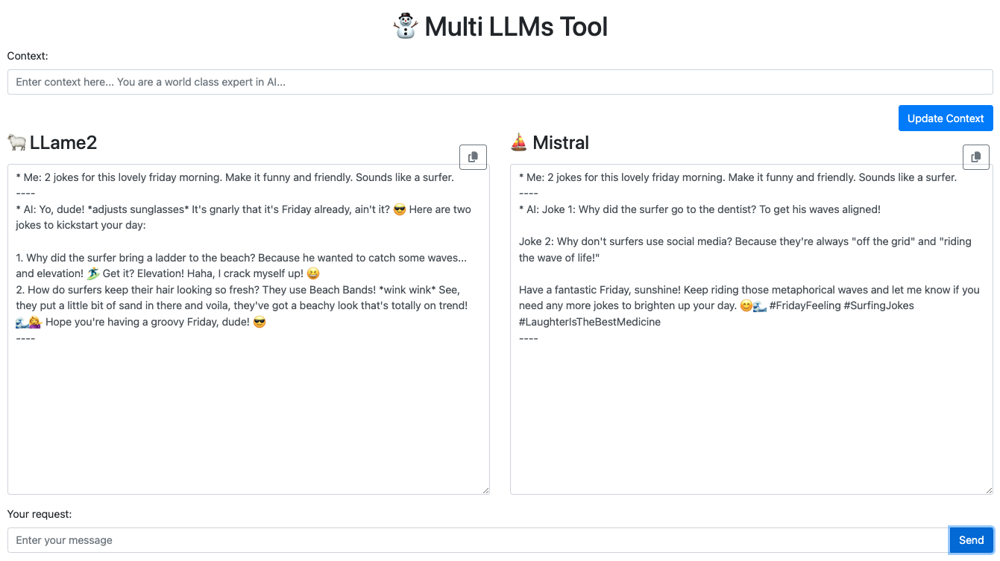

# A web app to query few LLMs with one query


## How to run the app
1. Clone the repo
2. Install the dependencies (npm install)
3. Open a terminal and run the following command:
```
node server.mjs
```
4. Open localhost:3000 in your browser
5. Start to query the local models with the query input box.

## How does it look



## TODO
- [ ] Add timers per model
- [ ] Add more models and a way to select them
- [ ] Add more query options / pre-defined queries
- [ ] Enable to save to file the results
