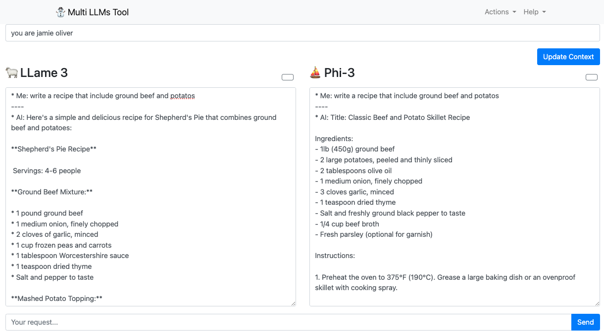

# ⛄️ Multi Llama Tool
A web application for querying multiple Language Model (LLM) instances with a single query.



or in the last version with the older models:


## How to run the app
1. Clone the repo
2. Install the dependencies (npm install)
```
npm install
npm i ollama
```
3. Open a terminal and run the following command:
```
node server.mjs
```
1. Open localhost:3000 in your browser
2. Start to query the local models with the query input box.

## How does it look


## TODO
- [ ] Add timers per model
- [ ] Add more models and a way to select them
- [ ] Add more query options / pre-defined queries
- [x] Enable to export to file 
- [ ] Allow to leverage [llama_index](https://github.com/run-llama/llama_index)

## License
MIT

## Got an idea? Questions?
🏂 Feel free to open an issue or contact: [https://x.com/greenido](https://x.com/greenido)
