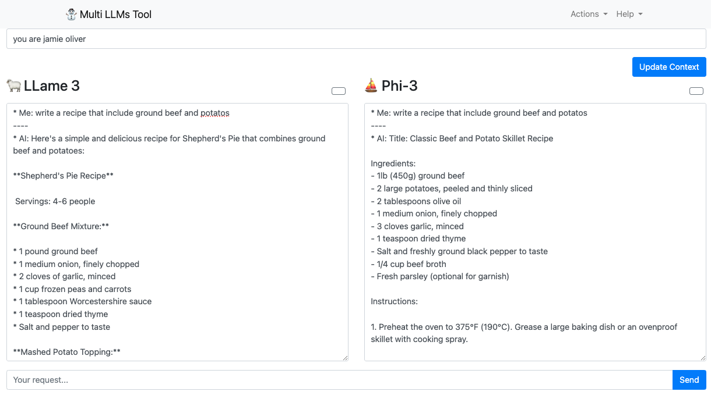

# ⛄️ Multi LLM Tool

Ask several LLMs the same question at once and compare their answers side by
side — local [Ollama](https://ollama.com) models, the OpenAI, Anthropic, Google
Gemini and Grok APIs, or a mix of both.



For a longer explanation of the why/how/when:
https://greenido.wordpress.com/2024/04/08/the-power-of-many-why-you-should-consider-using-multiple-large-language-models/

## What it does

- **Up to four models at once.** They all start together, so you wait for the
  slowest one rather than for the sum of all of them.
- **Local and cloud, side by side.** Compare a model running on your laptop
  against GPT, Claude, Gemini or Grok in the same row of panels.
- **Whatever you actually have.** The model list is read from Ollama and from
  each provider you have a key for, so a newly pulled model or a newly released
  one shows up in the picker with no code change.
- **Token counts per answer** and a running total per panel, because cloud
  models bill by the token and local ones do not.
- **Streams as it generates,** with a live timer per model and a final duration
  on every answer — the numbers you actually want when comparing models.
- **Stop** abandons a run and keeps whatever streamed in so far.
- **A real conversation per model.** Follow-up questions work, and each model
  only ever sees its own thread.
- **A system prompt** applied to every model, so you compare them under the
  same instruction.
- Answers render as markdown — tables, fenced code and lists read as
  themselves. Copy and export give you the raw text.

## Requirements

- Node 22.13 or newer (the API keys are kept in SQLite, using the built-in
  `node:sqlite` module)
- At least one of:
  - [Ollama](https://ollama.com) running locally with a model pulled
  - an API key for OpenAI, Anthropic, Google Gemini or xAI

Neither is required on its own. With no Ollama the app runs on cloud models
alone; with no keys it runs exactly as it did before.

For local models:

```bash
ollama serve
```

```bash
ollama pull llama3
```

## Run it

```bash
npm install
```

Development — Vite on `:5173` for the UI, the API on `:3000`, both at once:

```bash
npm run dev
```

Then open http://localhost:5173.

Production — one server on `:3000` serving the built bundle and the API:

```bash
npm run build && npm start
```

## API keys

Open **Settings** in the top bar and paste a key for any of OpenAI, Anthropic,
Google Gemini or xAI. **Test** checks it against the provider before you commit
to it. A provider with no key simply does not appear in the model picker.

Keys are held **on the server**, not in the browser. The settings API returns
only a masked hint (`sk-…4f2a`) — a saved key is never sent back to the page.

Where they live, and what that does and does not protect:

- They are written to `data/keys.db`, a SQLite file created with mode `0600`
  and ignored by git.
- They are stored **as plaintext**. Encrypting them with a passphrase kept on
  the same disk would look safer without being safer, so the real protections
  are the file permissions, your disk encryption, and `data/` staying out of
  version control.
- Anyone who can reach the server can spend your credits through it. It binds
  to all interfaces, so do not expose it to a network you do not trust, and if
  you ever put it behind a hostname, terminate TLS in front of it — a key typed
  into the settings modal crosses the wire on its way to the server.

If you would rather not type a key into a web page at all, set it in the
server's environment instead and the modal will show it as configured and
decline to delete it:

```bash
OPENAI_API_KEY=… ANTHROPIC_API_KEY=… GEMINI_API_KEY=… XAI_API_KEY=… npm run dev
```

A key stored through the modal takes precedence over the environment, so you can
override a deployment default without restarting.

## Tests

```bash
npm test
```

Unit tests cover the transcript and history logic, the model registry, the
streaming NDJSON parser, the SSE reader, the key store and the storage wrapper.

`providers.test.js` stands a stub in front of the four cloud adapters that
answers in each provider's real wire format, and asserts both directions: that
their frames parse, and that the API key, the system prompt and the history go
where each API expects them. The server tests boot the real server and cover
request validation, the settings routes and the unreachable-provider paths.

No test reaches a real provider, and none needs Ollama running.

## Configuration

All optional.

| Variable | Default | What it does |
| --- | --- | --- |
| `PORT` | `3000` | Port the API listens on. |
| `OLLAMA_URL` | `http://localhost:11434` | Where to reach Ollama. |
| `QUERY_TIMEOUT_MS` | `120000` | Abort a model that never finishes. |
| `NODE_ENV` | — | Set to `production` to serve `dist/`. |
| `KEYS_DB` | `data/keys.db` | Where the API keys are stored. |
| `OPENAI_API_KEY` etc. | — | A key supplied by the environment instead of the modal. |
| `ANTHROPIC_MAX_TOKENS` | `4096` | Anthropic requires a cap on every request. |
| `OPENAI_BASE_URL` etc. | the provider | Point an adapter somewhere else — a proxy, or a stub. |

## How it is put together

```
index.html            Vite entry
src/App.jsx           state: models, selection, transcripts, in-flight requests
src/components/       Navbar, ContextBar, ModelPicker, ModelPanel, QueryBar,
                      SettingsModal, Markdown
src/lib/              models (catalogue), settings (keys), transcript (history),
                      stream (NDJSON), duration, storage
server.mjs            Express API and routing
server/keystore.mjs   API keys in SQLite, masked on the way out
server/registry.mjs   every provider's models under one namespaced list
server/providers/     one adapter per provider, plus the shared SSE reader
test/                 node:test suites
```

The server keeps no conversation state. The browser owns the transcript and
sends it whole with each request, so two tabs cannot clobber each other. The
only thing the server persists is the API keys.

Every provider sits behind one adapter interface — `listModels(key)` and an
async-generator `chat()` — so the differences between four REST APIs (bearer
token vs `x-api-key` vs `x-goog-api-key`; the system prompt as a message, a
top-level field, or a `systemInstruction`; `assistant` vs `model`) stop at that
boundary. There is no vendor SDK: the wire formats are small and plain
`fetch` keeps the dependency count at zero.

Model ids are namespaced `provider:name` — `openai:gpt-4o`,
`ollama:llama3:latest` — and the catalogue doubles as the allowlist, so a
client cannot name a model that is not actually available.

`POST /query` takes `{ model, messages, system }` and replies with
newline-delimited JSON:

```
{"type":"chunk","text":"..."}                          zero or more
{"type":"usage","promptTokens":9,"completionTokens":4}   at most one
{"type":"done"}                  or {"type":"error","error":"..."}
```

The settings routes are `GET /api/settings`, `PUT`/`DELETE
/api/settings/:provider` and `POST /api/settings/:provider/test`. None of them
returns a key.

## Ideas / not done yet

- [x] Add timers per model
- [x] Add more models and a way to select them
- [x] Enable to export to file
- [x] Stream responses instead of waiting for the whole completion
- [x] Keep conversation history so follow-ups work
- [ ] Add more query options / pre-defined queries
- [ ] Save and reload past comparisons
- [ ] Show tokens/sec alongside the wall-clock timer
- [ ] Allow to leverage [llama_index](https://github.com/run-llama/llama_index)

## License

MIT

## Got an idea? Questions?

🏂 Feel free to open an issue or contact: [https://x.com/greenido](https://x.com/greenido)
