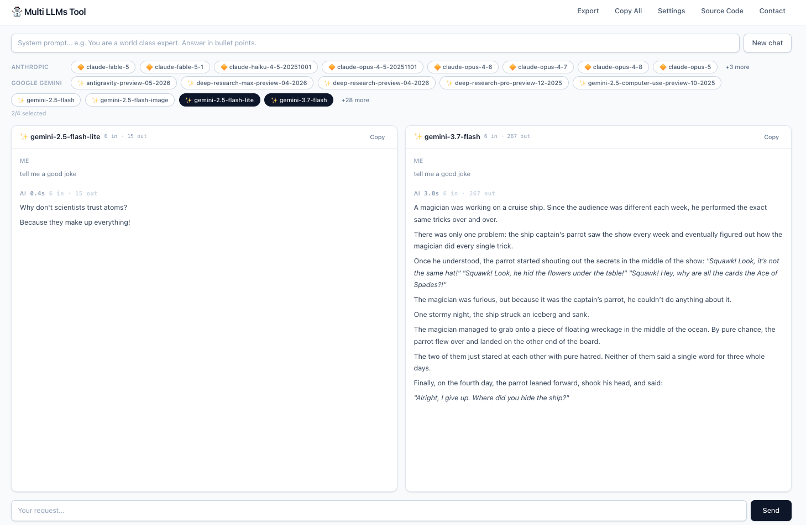

# ⛄️ Multi LLM Tool

[](https://github.com/greenido/multi-LLM-at-once/actions/workflows/ci.yml)

Ask several LLMs the same question at once and compare their answers side by
side — local [Ollama](https://ollama.com) models, the OpenAI, Anthropic, Google
Gemini and Grok APIs, or a mix of both.



For a longer explanation of the why/how/when:
https://greenido.wordpress.com/2024/04/08/the-power-of-many-why-you-should-consider-using-multiple-large-language-models/

## What it does

- **Up to four models at once.** They all start together, so you wait for the
  slowest one rather than for the sum of all of them.
- **Local and cloud, side by side.** Compare a model running on your laptop
  against GPT, Claude, Gemini or Grok in the same row of panels.
- **Whatever you actually have.** The model list is read from Ollama and from
  each provider you have a key for, so a newly pulled model or a newly released
  one shows up in the picker with no code change.
- **A picker that survives a long list.** Models sit in one row per provider,
  and a provider offering dozens of them shows the first few behind a
  `+28 more`. Anything selected stays visible, and pills hold their position
  so they do not jump under the cursor when a row expands.
- **A provider that will not answer still works.** If a live model listing
  fails, the row falls back to a curated list for that provider and flags
  itself as possibly incomplete rather than going empty.
- **Token counts per answer** and a running total per panel, because cloud
  models bill by the token and local ones do not. Reasoning a model does
  privately is counted too, since it is billed as output.
- **Streams as it generates,** with a live timer per model. Every answer then
  shows the numbers worth comparing: total time, **time to the first token**,
  and **tokens per second** once it started writing — so a model that is slow
  to start is not mistaken for one that is slow to write. Speed leaves out
  hidden reasoning tokens, which never stream, and a local model's speed is
  Ollama's own measurement. A **cold load** of a local model — the weights
  coming off disk — is shown on its own rather than counted against it.
- **Panels follow their own output** while it streams, so four models can be
  watched at once without scrolling four boxes by hand. Scroll one up to
  re-read an earlier answer and it stays where you put it until the next
  question.
- **Stop** abandons a run and keeps whatever streamed in so far.
- **Retry one panel.** A model that hit a rate limit, timed out or was stopped
  can be asked its last question again on its own. The panels beside it are
  not re-asked, and not billed again.
- **Multi-line prompts.** Paste code or a long question as it is: Enter sends,
  Shift+Enter starts a new line. The box grows with what you type.
- **A real conversation per model.** Follow-up questions work, and each model
  only ever sees its own thread.
- **A system prompt** applied to every model, so you compare them under the
  same instruction. It and your model selection are remembered across reloads;
  **New chat** clears every panel without touching either.
- **History.** Every comparison is saved as soon as its answers are in —
  question, answers, system prompt, panels and all. **History** lists them
  newest first and searches every question and answer. Open one and its panels
  come back as they were; ask a follow-up and it carries on, and moves back to
  the top. They are kept on the server, in SQLite — see below.
- **Saved prompts.** A **Prompts** menu beside the system prompt and beside the
  question box keeps named system prompts and questions to reuse — a few to
  start from, and whatever you save. Picking a question puts it in the box; it
  is not sent until you send it.
- Answers render as markdown — tables, fenced code and lists read as
  themselves. **Export** and **Copy** give you a Markdown document: the system
  prompt, each model's exact id, every answer as written, and the timings and
  token counts next to it.

## Requirements

- Node 22.13 or newer (the API keys are kept in SQLite, using the built-in
  `node:sqlite` module)
- At least one of:
  - [Ollama](https://ollama.com) running locally with a model pulled
  - an API key for OpenAI, Anthropic, Google Gemini or xAI

Neither is required on its own. With no Ollama the app runs on cloud models
alone; with no keys it runs exactly as it did before.

For local models:

```bash
ollama serve
```

```bash
ollama pull llama3
```

## Run it

```bash
npm install
```

Development — Vite on `:5173` for the UI, the API on `:3000`, both at once:

```bash
npm run dev
```

Then open http://localhost:5173.

Production — one server on `:3000` serving the built bundle and the API:

```bash
npm run build && npm start
```

## API keys

Open **Settings** in the top bar and paste a key for any of OpenAI, Anthropic,
Google Gemini or xAI. **Test** checks it against the provider before you commit
to it. A provider with no key simply does not appear in the model picker.

Keys are held **on the server**, not in the browser. The settings API returns
only a masked hint (`sk-…4f2a`) — a saved key is never sent back to the page.

Where they live, and what that does and does not protect:

- They are written to `data/keys.db`, a SQLite file created with mode `0600`
  and ignored by git.
- They are stored **as plaintext**. Encrypting them with a passphrase kept on
  the same disk would look safer without being safer, so the real protections
  are the file permissions, your disk encryption, and `data/` staying out of
  version control.
- Anyone who can reach the server can spend your credits through it, so it
  listens on `127.0.0.1` only. Reaching it from another machine is opt-in —
  set `HOST=0.0.0.0` — and if you do, put it behind something that
  authenticates and terminate TLS in front of it: a key typed into the settings
  modal crosses the wire on its way to the server.
- A web page you merely visit cannot drive the server on your behalf. Only JSON
  bodies are parsed, which makes every route preflighted, and a state-changing
  request carrying an `Origin` that is not the app's own is refused. Add
  `ALLOWED_ORIGINS` if you serve the UI from somewhere else.
- Nor can it read your history through DNS rebinding — re-pointing its own
  domain at `127.0.0.1` so the browser treats this server as that page's
  origin. While the server listens on loopback it answers only to `localhost`,
  `127.0.0.1`, `[::1]` and `*.localhost`; add any other name you reach it by
  to `ALLOWED_HOSTS`.

If you would rather not type a key into a web page at all, set it in the
server's environment instead and the modal will show it as configured and
decline to delete it:

```bash
OPENAI_API_KEY=… ANTHROPIC_API_KEY=… GEMINI_API_KEY=… XAI_API_KEY=… npm run dev
```

A key stored through the modal takes precedence over the environment, so you can
override a deployment default without restarting.

## History

Comparisons and saved prompts are kept in `data/history.db`, a second SQLite
file — separate from the keys, so history can be copied, backed up or deleted
without them. It gets the same treatment: mode `0600`, ignored by git, and
**plaintext**, so treat it like the conversations it holds. Delete a
comparison from **History**, or the whole file to start over.

A comparison is saved each time an exchange finishes, never mid-stream, and
only when something changed — opening one to read it does not move it to the
top. An exchange still streaming when you start a new chat or open another
comparison is abandoned rather than saved, as **New chat** always did.

## Tests

```bash
npm test
```

Unit tests cover the transcript and history logic, the Markdown export, the
timing and speed metrics, the model registry, the streaming NDJSON parser, the
SSE reader, the key store, the history store, the storage wrapper, the
stick-to-bottom rule the panels scroll by and the Enter-to-send rule the prompt
box follows.

`providers.test.js` stands a stub in front of the adapters that answers in
each provider's real wire format — Ollama's included — and asserts both
directions: that their frames parse, and that the API key, the system prompt
and the history go where each API expects them. It also pins down how each
provider reports a reasoning model's hidden tokens, which three of them do in
three different ways. The server tests boot the real server and cover
request validation, the settings, history and prompt routes, the
unreachable-provider paths, the cross-site requests that must not reach a
provider, and requests addressed to a name that is not this machine.

No test reaches a real provider, and none needs Ollama running.

### On every push and pull request

`.github/workflows/ci.yml` runs four things, none of which need a secret:

- **the suite, on Node 22.13 and 24.** 22.13 is the floor `package.json`
  declares, so it is the version that can actually break; `node:sqlite`, which
  the key store is built on, is still an experimental API, and testing only the
  newest release would hide the day it changes underneath the floor.
- **`npm run build`.** There are no component tests, so this is what stands
  between a broken import and `main`.
- **`npm audit`,** blocking on high and critical only. Six direct
  dependencies and no vendor SDKs — keeping this at zero is cheap.
- **a scan of the added lines for credentials.** This app's whole design is
  that keys stay out of the browser and out of git, and that is worth
  enforcing rather than remembering. The patterns match real key shapes
  narrowly, so the invented fixtures in the suite do not trip it, and it also
  fails if `data/` or a `.env` is ever force-added.

## Configuration

All optional.

| Variable | Default | What it does |
| --- | --- | --- |
| `PORT` | `3000` | Port the API listens on. |
| `HOST` | `127.0.0.1` | Address to bind. `0.0.0.0` exposes it to the network — see the warning above. |
| `ALLOWED_ORIGINS` | — | Comma-separated extra origins allowed to POST, for a UI served elsewhere. |
| `ALLOWED_HOSTS` | — | Comma-separated extra host names to answer to while bound to loopback. |
| `OLLAMA_URL` | `http://localhost:11434` | Where to reach Ollama. |
| `QUERY_TIMEOUT_MS` | `120000` | Abort a model that never finishes. |
| `NODE_ENV` | — | Set to `production` to serve `dist/`. |
| `KEYS_DB` | `data/keys.db` | Where the API keys are stored. |
| `HISTORY_DB` | `data/history.db` | Where saved comparisons and prompts are stored. |
| `OPENAI_API_KEY` etc. | — | A key supplied by the environment instead of the modal. |
| `ANTHROPIC_MAX_TOKENS` | `4096` | Anthropic requires a cap on every request. |
| `OPENAI_BASE_URL` etc. | the provider | Point an adapter somewhere else — a proxy, or a stub. |

## How it is put together

```
index.html            Vite entry
src/App.jsx           state: models, selection, transcripts, in-flight requests
src/components/       Navbar, ContextBar, ModelPicker, ModelPanel, QueryBar,
                      GrowingTextarea, HistoryPanel, PromptMenu, DeleteButton,
                      SettingsModal, Markdown
src/lib/              models (catalogue), settings (keys), history (saved
                      comparisons and prompts), transcript (what is sent back,
                      export), metrics (timings, speed), stream (NDJSON), api,
                      duration, storage, scroll (stick-to-bottom), keyboard
server.mjs            Express API and routing
server/keystore.mjs   API keys in SQLite, masked on the way out
server/historystore.mjs  saved comparisons and prompts in SQLite
server/registry.mjs   every provider's models under one namespaced list
server/providers/     one adapter per provider, plus the shared SSE reader
test/                 node:test suites
```

The browser owns the live conversation and sends it whole with each request,
so the query path keeps no state. What the server persists is the API keys
and, separately, history: a copy of each conversation, saved under an id the
browser picked when it started — so saving again replaces it, and two tabs
each write their own.

Every provider sits behind one adapter interface — `listModels(key)` and an
async-generator `chat()` — so the differences between four REST APIs (bearer
token vs `x-api-key` vs `x-goog-api-key`; the system prompt as a message, a
top-level field, or a `systemInstruction`; `assistant` vs `model`) stop at that
boundary. There is no vendor SDK: the wire formats are small and plain
`fetch` keeps the dependency count at zero.

Model ids are namespaced `provider:name` — `openai:gpt-4o`,
`ollama:llama3:latest` — and the catalogue doubles as the allowlist, so a
client cannot name a model that is not actually available.

Listings are cached per provider: Ollama for 10 seconds, so a model you just
pulled turns up almost at once, and the cloud catalogues for 5 minutes, since
they change slowly and their calls are metered. Saving or clearing a key
invalidates that provider's entry immediately. A listing that throws does not
empty the picker — the provider's curated fallback list stands in, and the
error rides along so the UI can say the row may be incomplete.

`GET /api/models` returns `{ models, providers }` — every queryable model,
and one entry per provider carrying its label, whether it is keyless, whether a
key is configured, how many models it offered and any listing error.

`POST /query` takes `{ model, messages, system }` and replies with
newline-delimited JSON:

```
{"type":"chunk","text":"..."}                          zero or more
{"type":"usage","promptTokens":9,"completionTokens":4}   at most one
{"type":"done"}                  or {"type":"error","error":"..."}
```

`completionTokens` is everything the model wrote, reasoning included. A usage
event can also carry `reasoningTokens` — how much of that was reasoning — and,
from Ollama, `loadMs` and `evalMs`: how long the model took to load and to
decode.

The settings routes are `GET /api/settings`, `PUT`/`DELETE
/api/settings/:provider` and `POST /api/settings/:provider/test`. None of them
returns a key.

History is `GET /api/comparisons` (newest first; `?q=` searches questions and
answers), and `GET`/`PUT`/`DELETE /api/comparisons/:id`. A comparison is
`{ title, system, models, transcripts }`, where `transcripts` maps each model id
to its turns; the server checks their shape and stores them as sent. Saved
prompts are `GET /api/prompts`, `POST /api/prompts` with `{ kind, name, text }`
— `kind` is `system` or `question` — and `DELETE /api/prompts/:id`.

## Ideas / not done yet

- [x] Add timers per model
- [x] Add more models and a way to select them
- [x] Enable to export to file
- [x] Stream responses instead of waiting for the whole completion
- [x] Keep conversation history so follow-ups work
- [x] Add more query options / pre-defined queries
- [x] Save and reload past comparisons
- [x] Show tokens/sec alongside the wall-clock timer
- [ ] Allow to leverage [llama_index](https://github.com/run-llama/llama_index)

## License

MIT

## Got an idea? Questions?

🏂 Feel free to open an issue or contact: [https://x.com/greenido](https://x.com/greenido)
